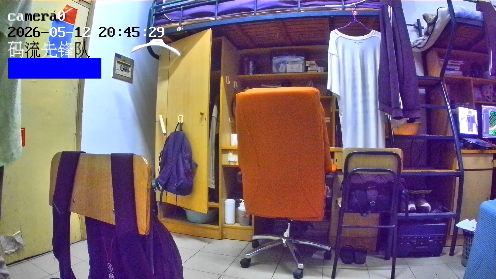

### 目前效果：


### 已完成：
旋转180度；mask变色；osd小组队名；自动反色；RTC标准时间

### 未完成：
双端录像；推流到rtsp server，目前只能udp推流；时间的年份字段反色不生效，始终一个颜色；传输码流时亮/闪灯；采集的画面有些偏紫，可能是参数包imx415_mipi_attr.hex的问题；rtsp server待完成；开发板只能跑一次程序，后面会出现pkg load err，segmentfault问题；

### 运行流程:
虚拟机上:
1. 先把厂商SDK添加到项目里`vendor/fullhan/FH8862_IPC_V1.0.0_20221111/`，看下面的项目结构图，SDK太大不适合传到github上
2. `make`编译
3. `cp /build/videostream /mnt/nfs_share`
4. 把/driver复制到板子上，`cp -r videostream/platform/fh8862/driver /mnt/nfs_share`
5. 把参数包也复制上去 `cp videostream/platform/fh8862/lib/imx415_mipi_attr.hex /mnt/nfs_share`

开发板上:
1. 开发板挂载共享文件夹 `mount -t nfs 192.168.1.1:/mnt/nfs_share /mnt -o nolock`
2. `cd /mnt`
3. `ls` 查看应该有 `/driver` 和 `imx415_mipi_attr.hex` 还有编译产物 `videostream`
4. 打驱动 `cd /driver && ./load_modules_FH8862.sh`
5. 复制库文件 `cp imx415_mipi_attr.hex /home`
3. 现在只能udp，开发板上运行`./videostream 192.168.1.2`；RTSP server写完后可能就直接 `./videostream`


### 项目结构:
```text
videostream/
├── app/
│   ├── main.c                 # 整个项目入口
│   └── app-config.h           # 应用级配置预留?
│
├── modules/
│   ├── capture/               #视频采集代码照搬
│   │   ├── inc/
│   │   └── src/			   
│   │
│   ├── rtsp/                  # RTSP server
│   ├── common/                # 公共类型、日志、工具接口预留 ?
│   │   ├── led/
│   │   │   ├── inc/
│   │   │   └── src/
│   │   │
│   │   └── rtc/               #RTC时钟
│   │       ├── inc/
│   │       └── src/
│   │
│   └── Qt,yolo等等各个模块/
│
├── platform/
│   └── fh8862/                # 原来视频采集项目里的一些包，照搬的
│       ├── include/
│       ├── lib/
│       ├── driver/
│       └── Makefile
│
├── vendor/
│   └── fullhan/
│       └── FH8862_IPC_V1.0.0_20221111/    # 原始厂商 SDK       
│
├── legacy/
│   ├── catch/                 # 视频采集备份
│   └── rtspserver/            # RTSP server备份
│
├── docs/
├── build/
└── makefile
```